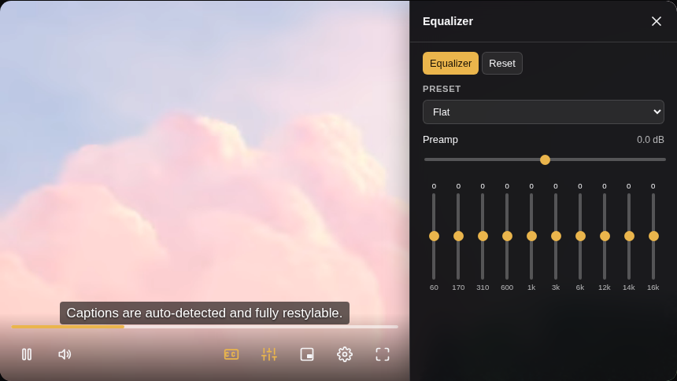
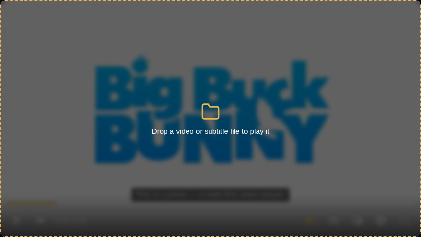
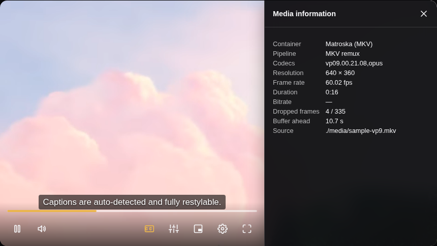
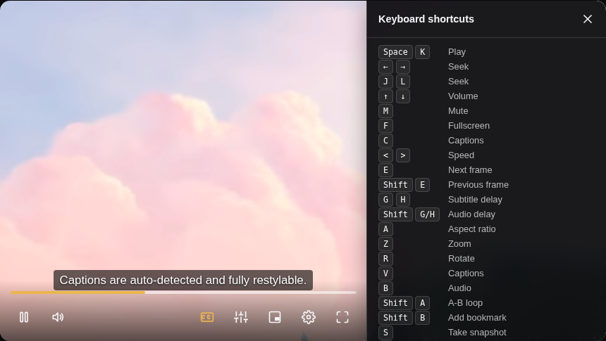

# Lumen

**Beautiful. Simple. Unbreakable. Lightweight.**

Lumen is a web-first, framework-agnostic video player built as a native
Web Component. Drop in one tag and it plays **MP4, MOV, MKV, AVI, WebM,
Ogg, FLV, MPEG-TS, HLS and DASH** — including formats no browser supports
natively — with a premium default UI, a ten-band equalizer, picture
adjustments, A→B looping, snapshots, deep subtitle customization, DRM,
ads, and a clean TypeScript API.

It is, deliberately, the player VLC would be if it were a `<video>` tag.

📖 **[Documentation](docs/index.html)** · 🎬 **[Live examples](examples/index.html)**



```html
<script type="module" src="https://unpkg.com/@lumen/player/dist/lumen.js"></script>
<lumen-player src="https://example.com/video.m3u8" poster="poster.jpg"></lumen-player>
```

Or from npm:

```bash
npm install @lumen/player
```

```js
import "@lumen/player";
```

```html
<lumen-player id="player" src="video.mp4"></lumen-player>
<script type="module">
  const player = document.getElementById("player");
  player.on("play", () => console.log("playing"));
</script>
```

## Why Lumen

- **Plays what other players won't.** MKV, MOV and MPEG-TS are rejected by
  every browser's `<video>` element. Lumen identifies a file by its bytes
  and, where the container is the only obstacle, rebuilds it as fragmented
  MP4 in JavaScript — no transcoding, no WASM decoder, no quality loss.
- **Everything a desktop player has.** A ten-band equalizer with VLC's own
  preset curves, volume boost past 100%, audio and subtitle sync, stereo
  routing, a normalizer, brightness/contrast/saturation/hue/gamma, zoom,
  rotation, aspect-ratio and crop control, A→B looping, frame stepping,
  snapshots, bookmarks, resume-where-you-left-off, a media information
  panel, and files opened by dropping them on the player.
- **Small core, zero required dependencies.** ~40 kB gzipped for the whole
  player. HLS (`hls.js`), DASH (`dashjs`), the corrupt-MP4 fallback
  (`mp4box`), the MKV/FLV/AVI remuxers, the Web Audio graph, the side
  panels, the subtitle converters, the ads plugin and the framework
  wrappers are all separate lazily-loaded chunks — pages that don't need
  them never download them, and CI enforces the budget.
- **Beautiful by default.** A dark-first, premium control surface that needs
  zero configuration, plus a light theme and full CSS custom-property
  theming for everything else.
- **Resilient.** Network blips and partial/incomplete files trigger
  automatic, backed-off recovery instead of a dead black box with a cryptic
  browser error.
- **Real subtitle support.** Auto-detected tracks, a styling panel (size,
  color, background, edge, position, timing offset), and persisted user
  preferences — rendered through Lumen's own overlay so styling isn't at
  the mercy of the browser's native caption box.
- **A real Web Component.** Works from plain HTML/JS, and in React, Vue,
  Svelte, or anything else, without a wrapper.

## Format support

Lumen sniffs the first bytes of a file to identify its container, so a
`.mkv` renamed to `.mp4`, or a signed CDN URL with no extension at all,
still routes correctly. Extensions and `Content-Type` headers are hints,
never the deciding factor.

| Container | How it plays | Notes |
| --- | --- | --- |
| **MP4 / M4V** | Native | Fast path — no sniffing round trip |
| **WebM** | Native | |
| **Ogg / OGV** | Native | |
| **HLS** (`.m3u8`) | Native on Safari, else `hls.js` | ABR + quality menu |
| **MOV / QuickTime** | Native, else remuxed | Browsers reject the `video/quicktime` MIME even when they can decode the contents; Lumen remuxes rather than giving up |
| **MKV / Matroska** | Remuxed to fragmented MP4 | No browser plays MKV natively. Embedded subtitles are extracted too |
| **MPEG-TS** (`.ts`, `.m2ts`) | `hls.js` transmuxer | Reuses hls.js's TS support instead of duplicating a demuxer |
| **DASH** (`.mpd`) | `dash.js` | ABR + quality menu |
| **FLV** | Remuxed to fragmented MP4 | Carries H.264/AAC directly, so it's a copy |
| **AVI** | Remuxed to fragmented MP4 | H.264 video with MP3 or AAC audio. Annex B is re-framed as length-prefixed NAL units; MP3 timing comes from counting frames, not the header |
| **Truncated / corrupt MP4** | `mp4box.js` + MSE | See [Resilience](#resilience) |
| **WMV/ASF, MPEG-PS** | ❌ Detected, not played | Reported as `CONTAINER_UNSUPPORTED` with a message telling the viewer what to do, instead of a blank player |

### Remuxing, and what limits it

Playing a video needs two things: a **container** the player can parse, and
**codecs** the browser can decode. Those fail independently, and conflating
them is why players usually say nothing more useful than "format not
supported".

Containers are just packaging, so Lumen rebuilds them in JavaScript: an MKV
is demuxed and rewritten as fragmented MP4 for Media Source Extensions,
with the compressed frames copied across untouched. It's fast, lossless,
and streams while downloading.

Codecs are the hard limit. Lumen can't decode what the browser can't, so it
asks (`MediaSource.isTypeSupported`) before committing and degrades in
useful steps:

| Source codec | Result |
| --- | --- |
| H.264, HEVC, VP9, AV1 video | Remuxed and played (subject to browser/OS support) |
| AAC, Opus, FLAC, MP3 audio | Remuxed and played |
| **AC-3, DTS, TrueHD, PCM audio** | Audio track dropped, **video still plays**, viewer told why |
| **MPEG-4 ASP (DivX/Xvid), MJPEG, WMV** | Named in the error — "This AVI's video is MPEG-4 ASP (XVID), which no browser can decode" — instead of the container taking the blame |
| Undecodable video codec | Clear message naming the fix, rather than a dead player |

That AC-3 case matters more than it sounds: it's the single most common
reason an MKV "won't play", and dropping one track beats refusing the file.

Transcoding between codecs is deliberately out of scope — doing it in the
browser means shipping a multi-megabyte WASM decoder, which would cost more
than the rest of the player combined. For those files, convert server-side
and use the `CONTAINER_UNSUPPORTED` error to prompt for it.

## Features

| Area | Status |
| --- | --- |
| Native progressive MP4/WebM/Ogg playback | ✅ |
| MKV/Matroska via built-in JS demuxer + fMP4 remuxer | ✅ (see [Format support](#format-support)) |
| MOV/QuickTime and MPEG-TS | ✅ |
| Container detection by magic bytes, not file extension | ✅ |
| Embedded MKV subtitles (SRT-style and ASS/SSA) surfaced as text tracks | ✅ |
| HLS (VOD + live) via `hls.js`, with native fallback on Safari/iOS | ✅ |
| Automatic + manual quality selection | ✅ |
| Playback rate control (0.25×–2×) | ✅ |
| Keyboard shortcuts, full a11y (ARIA, focus rings, screen-reader status) | ✅ |
| Picture-in-Picture, fullscreen, double-click-to-fullscreen | ✅ |
| Auto-detected subtitles/captions, styling panel, persisted prefs | ✅ |
| Scrub-bar preview (time tooltip; thumbnail sprite via WebVTT if provided) | ✅ |
| CSS custom-property theming, dark/light/system themes | ✅ |
| Network/decode error recovery with backoff, calm error UI | ✅ (see [Resilience](#resilience)) |
| Best-effort playback of truncated/corrupt progressive MP4s via `mp4box.js` + MSE | ✅ (see [Resilience](#resilience)) |
| Chapters — progress-bar markers, scrub titles, jump menu | ✅ |
| Playlists with auto-advance and next/previous controls | ✅ |
| Audio track selection (HLS, native, and MKV) | ✅ |
| Casting — AirPlay and the Remote Playback API | ✅ |
| Full internationalization of every UI string | ✅ |
| MPEG-DASH via `dashjs` | ✅ |
| DRM — Widevine, PlayReady, FairPlay | ✅ |
| VAST 2–4 linear ads (pre/mid/post-roll) as an optional plugin | ✅ |
| FLV playback via built-in demuxer + fMP4 remuxer | ✅ |
| Plugin architecture, ambient mode | ✅ |
| Offline/PWA helpers (Cache API + range-aware service worker) | ✅ |
| React, Vue and Svelte wrappers | ✅ |
| AVI via built-in RIFF demuxer + fMP4 remuxer | ✅ |
| Ten-band equalizer with VLC's eighteen preset curves | ✅ (see [The VLC toolkit](#the-vlc-toolkit)) |
| Volume boost to 300%, audio delay, stereo routing, volume normalizer | ✅ |
| Brightness, contrast, saturation, hue, gamma | ✅ |
| Zoom, rotation, flips, forced aspect ratio, crop-to-fill | ✅ |
| A→B looping, frame stepping, snapshots, bookmarks | ✅ |
| Subtitle delay, and SRT / ASS / SSA / SubViewer / MicroDVD conversion | ✅ |
| Open local files by drag-and-drop or file picker | ✅ |
| Media information and live playback statistics | ✅ |
| Resume where you left off, shuffle, repeat one/all | ✅ |

## The VLC toolkit

Everything below is in the player itself — no plugin, no configuration.
Press <kbd>?</kbd> in any player for the full keyboard reference, or open
`examples/effects.html` to try all of it.

| Panel | Opens with | What's in it |
| --- | --- | --- |
| **Equalizer** | <kbd>q</kbd> | Ten bands, preamp, VLC's eighteen presets |
| **Effects** | <kbd>x</kbd> | Audio (boost, delay, stereo mode, normalizer), Video (brightness, contrast, saturation, hue, gamma, zoom, rotation, flips, aspect ratio, fit), Captions (delay, size, background, edge, position) |
| **Playlist** | <kbd>p</kbd> | The queue, repeat modes, shuffle, bookmarks, "open file" |
| **Media information** | <kbd>i</kbd> | Container, pipeline, codecs, resolution, measured frame rate, bitrate, dropped frames, buffer health |
| **Shortcuts** | <kbd>?</kbd> | Every binding |

### Equalizer

The ten centre frequencies (60 Hz … 16 kHz) and all eighteen preset curves
are the ones VLC ships, running through Web Audio biquad filters — a
shelf at each end, peaks in between, each band's Q derived from the
geometric distance to its neighbours so the three crowded bands above
12 kHz don't pile on top of each other.

```js
player.setEqualizerPreset("rock");
player.audio.set({ preamp: -3, bands: [8, 4.8, -5.6, -8, -3.2, 4, 8.8, 11.2, 11.2, 11.2] });
player.audio.effects; // the current state, including which preset it matches
```

One deliberate difference from VLC: VLC stores each preset's preamp on the
0–20 scale it inherited from Winamp, where 12 means unity. Applying that
literally in a browser would add +12 dB to a flat curve and clip
everything, so Lumen re-bases those values against flat's 12 — the same
relative relationship, at a level a browser can actually play.

### Audio

```js
player.audio.set({
  boost: 1.8,        // 100%–300%, past what video.volume allows
  delayMs: 200,      // audio plays later, for a track that runs ahead
  stereo: "mono",    // stereo | mono | left | right | swap
  normalize: true,   // dynamic-range compression, VLC's volume normalizer
});
```

The audio graph is built the first time an effect leaves its default, and
not before: routing an element through Web Audio is permanent for the life
of that element, costs an AudioContext, and breaks AirPlay handoff. It
also **requires same-origin media or the `crossorigin` attribute** — Web
Audio silently zeroes cross-origin audio that wasn't fetched with CORS, so
Lumen checks first and reports `audioEffectsUnavailable` rather than
muting the video. `player.audio.isAvailable` tells you up front.

Audio delay only runs in one direction. A `DelayNode` can hold audio back;
nothing can hold back a video element's own rendering, so "audio earlier
than video" has no browser equivalent.

### Picture

```js
player.setVideoFilters({ brightness: 1.2, contrast: 1.3, saturation: 0.15, hue: 20, gamma: 1.8 });
player.filters.rotate();             // a quarter turn, as VLC's `r` does
player.filters.cycleAspectRatio();   // source → 16/9 → 4/3 → 1/1 → …
player.filters.cycleZoom();          // 25% → 50% → 100% → 200% → 400%
player.setVideoFilters({ fit: "fill", flipHorizontal: true });
```

All of it is a CSS `filter` and `transform` on the video element, so it
costs nothing until a control moves, runs on the GPU, and never touches
the decoded frames. Gamma is the one adjustment CSS has no primitive for,
so it goes through a small inline SVG `feComponentTransfer` filter that is
only referenced while gamma is off its default.

### Looping, stepping, snapshots, bookmarks

```js
player.cycleAbLoop();                  // A, then B, then clear
player.setAbLoop({ start: 12, end: 18 });
player.abLoop;                         // { start, end } | null

player.stepFrame(1);                   // and -1 to step back
player.frameRate;                      // measured, not guessed — null until known

await player.saveSnapshot();           // downloads a PNG of the current frame
const blob = await player.snapshot({ type: "image/jpeg", quality: 0.9, width: 1280 });

player.addBookmark("The good bit");
player.bookmarks;                      // [{ time, label }], pinned to the scrub bar
player.removeBookmark(time);
```

Snapshots re-apply Lumen's own colour adjustments to the canvas, so the
saved image matches the picture on screen rather than what the decoder
produced. Cross-origin media without CORS can't be read back at all, and
that case is reported as such instead of saving a blank frame.

### Local files

```js
player.openFiles(fileList);   // videos become the queue; subtitles attach
player.openFile(file);
await player.addSubtitleFile(srtFile);
```

Drag a video onto the player, or press <kbd>o</kbd>. Subtitles in **SRT,
ASS/SSA, SubViewer and MicroDVD** are converted to WebVTT in the browser —
the only format `<track>` accepts — so dropping a movie and its `.srt`
together does the obvious thing. Dropping several videos builds a playlist
in natural filename order, so a season folder queues up as episodes 1, 2,
… 10 rather than 1, 10, 2.



### Media information

```js
player.mediaInfo();
// { container: "Matroska (MKV)", engine: "MKV remux", codecs: "vp09.00.21.08,opus",
//   width: 640, height: 360, frameRate: 60.02, duration: 16.2, bitrateKbps: null,
//   droppedFrames: 3, decodedFrames: 334, bufferAheadSeconds: 10.8, … }
```

Frame rate is measured from `requestVideoFrameCallback` — the presentation
time of frames the compositor actually showed — because a remuxed stream's
container may carry no frame-rate field at all.



### Resume, repeat and shuffle

```js
player.repeat = "all";   // "off" | "one" | "all"
player.shuffle = true;
```

Playback position is remembered per file and restored on the next visit,
keyed on the URL with its query string stripped so an expiring signed CDN
link still matches. Positions under 30 seconds and within 20 seconds of the
end are ignored, so it never hijacks a file that barely started or already
finished. `resume="off"` on the element turns it off entirely.

## Keyboard

Where a VLC binding and a web-player binding disagree, the web one wins:
<kbd>j</kbd>/<kbd>l</kbd> have meant "seek ten seconds" to anyone who
watches video in a browser for a decade, and breaking that to match a
desktop app would cost more than it gained. Everything VLC binds that the
web has no opinion about is kept exactly as VLC has it.

| Keys | Action |
| --- | --- |
| <kbd>Space</kbd> <kbd>k</kbd> | Play/pause |
| <kbd>←</kbd> <kbd>→</kbd> | Seek ±5 s |
| <kbd>j</kbd> <kbd>l</kbd> | Seek ±10 s |
| <kbd>↑</kbd> <kbd>↓</kbd> | Volume |
| <kbd>m</kbd> / <kbd>f</kbd> / <kbd>c</kbd> | Mute / fullscreen / captions |
| <kbd>&lt;</kbd> <kbd>&gt;</kbd> | Playback speed |
| <kbd>e</kbd> / <kbd>Shift</kbd>+<kbd>e</kbd> | Step one frame forward / back |
| <kbd>g</kbd> <kbd>h</kbd> | Subtitle delay ∓50 ms |
| <kbd>Shift</kbd>+<kbd>g</kbd> / <kbd>Shift</kbd>+<kbd>h</kbd> | Audio delay ∓50 ms |
| <kbd>a</kbd> / <kbd>z</kbd> / <kbd>r</kbd> | Cycle aspect ratio / zoom / rotation |
| <kbd>v</kbd> / <kbd>b</kbd> | Cycle subtitle track / audio track |
| <kbd>Shift</kbd>+<kbd>a</kbd> | A→B loop |
| <kbd>Shift</kbd>+<kbd>b</kbd> | Add a bookmark |
| <kbd>s</kbd> | Snapshot |
| <kbd>n</kbd> / <kbd>Shift</kbd>+<kbd>n</kbd> | Next / previous item |
| <kbd>Shift</kbd>+<kbd>r</kbd> / <kbd>Shift</kbd>+<kbd>l</kbd> | Shuffle / repeat mode |
| <kbd>q</kbd> <kbd>x</kbd> <kbd>p</kbd> <kbd>i</kbd> | Equalizer, effects, playlist, media info |
| <kbd>o</kbd> | Open a file |
| <kbd>?</kbd> | Every shortcut, in the player |
| <kbd>0</kbd>–<kbd>9</kbd> | Seek to 0%–90% |
| <kbd>Esc</kbd> | Close the open menu or panel |



## Quick start

```html
<lumen-player
  src="https://example.com/video.m3u8"
  poster="https://example.com/poster.jpg"
  theme="dark"
>
  <track kind="subtitles" src="en.vtt" srclang="en" label="English" default />
</lumen-player>
```

Multiple sources (Lumen picks the best one; an explicit HLS source wins if
the browser can play it):

```html
<lumen-player>
  <source src="video.m3u8" data-lumen-type="hls" />
  <source src="video.mp4" data-lumen-type="mp4" />
</lumen-player>
```

See `examples/` for runnable pages: `basic.html`, `hls.html`,
`subtitles.html`, `theming.html`, `formats.html`, `effects.html`,
`resilience.html`, `playlist.html`, `i18n.html` — or open
`examples/index.html` for an index of all of them. Run `npm run dev` and
open it from the printed local URL.

> `resilience.html` needs a real H.264/AAC-capable browser (regular Chrome,
> Edge, Firefox, Safari). Minimal open-source Chromium builds — including
> the one Playwright downloads by default — ship without licensed H.264/AAC
> decoders, so `MediaSource.isTypeSupported()` correctly reports the codec
> as unsupported there and the demo falls through to the calm error UI
> instead of playing. That's the codec check working as intended, not a bug
> in the fallback itself — see `test/ResilientMp4Engine.pipeline.test.ts`,
> which exercises the real mp4box.js segmentation pipeline end-to-end
> against a fake `MediaSource` to verify that independently of codec
> support.

## JavaScript API

```ts
const player = document.querySelector("lumen-player");

// Playback
player.play();
player.pause();
player.seek(30);
player.currentTime = 30;
player.volume = 0.5;
player.muted = true;
player.playbackRate = 1.5;

// Loading
await player.load({ src: "https://example.com/video.m3u8" });
await player.load([{ src: "a.m3u8" }, { src: "b.mp4" }]);

// Quality (HLS)
player.qualityLevels;      // LumenQualityLevel[]
player.currentQuality;     // LumenQualityLevel | null
player.setQuality("auto"); // or a level id

// Subtitles
player.textTracks;                       // TextTrack[]
player.addTextTrack({ src: "fr.vtt", label: "Français", srclang: "fr" });
player.setSubtitlePrefs({ fontSize: 1.3, edge: "outline", offsetSeconds: 0.5 });

// Audio tracks (HLS, native, or MKV)
player.audioTracks;            // LumenAudioTrack[]
player.setAudioTrack("fr");

// Chapters
player.chapters;               // LumenChapter[]
player.currentChapter;         // LumenChapter | null
player.setChapters([{ start: 0, end: 60, title: "Intro" }]);

// Playlists — auto-advances when each item ends
player.playlist = [
  { src: "one.mkv", title: "First", chapters: "one.vtt" },
  { src: "two.mp4", title: "Second", poster: "two.jpg" },
];
player.next();
player.previous();
player.playItem(1);
player.playlistIndex;

// Audio effects — see "The VLC toolkit" above
player.audio;                            // AudioController
player.audioEffects;                     // current state
player.setEqualizerPreset("rock");
player.setAudioEffects({ boost: 1.5, delayMs: 120, stereo: "mono", normalize: true });

// Picture adjustments and geometry
player.filters;                          // VideoFilters
player.videoFilterState;
player.setVideoFilters({ brightness: 1.2, gamma: 1.6, zoom: 1.5, rotation: 90 });

// Looping, stepping, snapshots, bookmarks
player.cycleAbLoop();
player.setAbLoop({ start: 12, end: 18 });
player.abLoop;
player.stepFrame(1);
player.frameRate;
await player.saveSnapshot();
player.addBookmark("The good bit");
player.bookmarks;

// Playback memory and queue behaviour
player.repeat = "all";                   // "off" | "one" | "all"
player.shuffle = true;

// Subtitle timing, and files from the viewer's machine
player.subtitleOffset = 0.5;             // seconds; positive shows cues later
await player.openFiles(files);
await player.addSubtitleFile(srtFile);   // SRT, ASS/SSA, SubViewer, MicroDVD

// Panels
player.openPanel("equalizer");           // "playlist" | "equalizer" | "effects" | "info" | "shortcuts" | null
player.panel;

// What is playing, and how well
player.mediaInfo();

// Casting (AirPlay / Remote Playback)
player.isCastAvailable;
await player.requestCast();

// Translation — omitted keys fall back to English
player.setTranslations({ play: "Lecture", settings: "Réglages" });

// Events
const off = player.on("timeupdate", ({ currentTime, duration }) => { /* ... */ });
player.once("ready", () => console.log("mounted"));
off();

// Fullscreen / PiP
player.requestFullscreen();
player.requestPictureInPicture();

player.destroy(); // tear down engine + listeners
```

### Events

`play`, `pause`, `ended`, `timeupdate`, `progress`, `volumechange`,
`ratechange`, `waiting`, `playing`, `canplay`, `seeking`, `seeked`, `error`,
`qualitychange`, `qualitieschange`, `texttrackchange`,
`embeddedtexttrack`, `chapterschange`, `chapterchange`,
`audiotrackschange`, `audiotrackchange`, `playlistchange`,
`playlistitemchange`, `castavailabilitychange`, `abloopchange`,
`videofilterchange`, `audioeffectchange`, `bookmarkschange`, `snapshot`,
`repeatchange`, `shufflechange`, `panelchange`, `resume`,
`enterfullscreen`, `exitfullscreen`, `enterpip`, `leavepip`,
`loadedmetadata`, `ready`, `destroy`. Full payload types are in
`src/types.ts`.

### Attributes

`src`, `poster`, `autoplay`, `loop`, `muted`, `crossorigin`, `preload`,
`theme` (`dark` | `light` | `system`), `aspect-ratio` (e.g. `16/9`),
`object-fit` (e.g. `contain` | `cover`), `thumbnails` (URL to a WebVTT
sprite sheet, the format used by Mux/Bunny/Vimeo-style scrub previews),
`chapters` (URL to a WebVTT chapters file), `resume` (set to `off` to stop
remembering playback positions for this player).

### Internationalization

Every control label, menu entry, screen-reader announcement and error
message resolves through one string table, so the player can be translated
without forking it or reaching into the shadow DOM:

```js
player.setTranslations({
  play: "再生",
  pause: "一時停止",
  settings: "設定",
});
```

Any key you leave out keeps its English default, so a partial translation
degrades to mixed language rather than blank buttons. The full key list is
the `LumenStrings` interface in `src/i18n.ts`.

## Theming

Every visual token is a CSS custom property with a self-referencing
fallback (`var(--lumen-color-accent, #eab54c)`), so you can override any of
them from page-level CSS without piercing the shadow root:

```css
lumen-player {
  --lumen-color-accent: #7c5cff;
  --lumen-radius: 20px;
  --lumen-font-family: "Georgia", serif;
}
```

`theme="light"` and `theme="system"` (follows `prefers-color-scheme`) are
built in. See `examples/theming.html` and `src/styles/player.css` for the
full token list.

## CORS & Range requests (R2, B2, Bunny, self-hosted)

Progressive "watch while downloading" and seeking both rely on HTTP Range
requests, and cross-origin playback needs CORS headers. Make sure your
origin serves:

- `Access-Control-Allow-Origin` (and `Access-Control-Allow-Methods: GET,
  HEAD, OPTIONS`) for any origin the player is embedded on.
- `Accept-Ranges: bytes` and honors `Range` request headers with `206
  Partial Content` responses.
- `Access-Control-Expose-Headers: Content-Length, Content-Range,
  Accept-Ranges` so the browser's media pipeline can read them.

Cloudflare R2, Backblaze B2, and Bunny Storage/Stream all support this —
enable CORS on the bucket/pull zone and Range requests come for free from
the underlying object storage. If you set `crossorigin`, the player mirrors
it onto the underlying `<video>` element (needed for canvas/WebGL post-
processing or reading `TextTrack` cues cross-origin). The `mp4box.js`
resilience fallback (see below) fetches the file itself via `fetch()`, so
it needs the same CORS headers — no extra configuration beyond the above.

## Resilience

Two layers, applied in order, before Lumen ever shows an error:

1. **Retry/backoff.** Native `<video>` and `hls.js` error events are
   intercepted: transient network errors reconnect automatically, decode
   errors trigger a reload-in-place at the same `currentTime`, with a
   short backoff between attempts (500ms/1.5s/4s). This alone handles most
   real-world blips — flaky wifi, a CDN hiccup, a mid-download server
   restart.

2. **`mp4box.js` + MSE fallback (progressive MP4 only).** If retries are
   exhausted (or the browser rejects the file outright as
   `SRC_NOT_SUPPORTED` — common when a `moov` atom is missing or truncated
   because an upload was interrupted), Lumen makes one more attempt: it
   streams the file itself via `fetch()`, feeds the bytes into
   `mp4box.js` incrementally as they arrive, remuxes them into fragmented
   MP4 segments, and appends those directly to a `MediaSource`
   `SourceBuffer` — bypassing the browser's own (stricter) built-in MP4
   parser entirely. Because mp4box.js processes boxes as they arrive, a
   file that's truncated or has a broken tail still plays everything
   before the break, instead of refusing to play at all.

   This is a genuine, working fallback, not a stub — but it's honestly
   scoped: MP4 only (mp4box.js doesn't handle WebM/Ogg), audio+video are
   muxed into a single combined `SourceBuffer`, and seeking is clamped to
   whatever's already buffered (arbitrary random-access seeking into
   unbuffered regions would require re-fetching with a `Range` request at
   a byte offset mp4box.js hasn't parsed yet — out of scope for this
   pass). It also needs `mp4box` present the same way `hls.js` is: `npm
   install mp4box` for bundler consumers, or `window.MP4Box` set manually
   for plain-script-tag pages (mp4box.js doesn't ship a CDN-friendly UMD
   global build the way hls.js does).

Only if both layers fail does Lumen show the calm error UI with a retry
button — never a raw `MediaError`.

## Architecture

```
src/
  core/
    EventEmitter.ts        tiny typed pub/sub (internal + public `on`/`off`)
    containers.ts          magic-byte container sniffing
    PlaybackEngine.ts      routing: native / hls.js / remux, ABR, retry
    ResilientMp4Engine.ts  mp4box.js + MSE fallback for broken MP4s
  remux/                   ← lazy-loaded; absent from the core bundle
    MseSink.ts             shared MediaSource + SourceBuffer queueing
    MatroskaRemuxEngine.ts MKV demux → fMP4 mux → MSE, track selection
    FlvRemuxEngine.ts      FLV demux → fMP4 mux → MSE
    AviRemuxEngine.ts      AVI demux → fMP4 mux → MSE
    matroska/
      ebml.ts              EBML variable-length integers + element IDs
      MatroskaDemuxer.ts   streaming Matroska parser
    avi/
      AviDemuxer.ts        streaming RIFF/AVI parser
      h264.ts              Annex B ⇄ length-prefixed NAL framing, avcC
      mp3.ts               MPEG audio frame headers, for exact audio timing
    mp4/
      boxes.ts             ISO-BMFF box-writing primitives
      Mp4Muxer.ts          fMP4 init + media segment generation
      sampleEntries.ts     codec → sample entry + RFC 6381 codec string
  audio/
    presets.ts             VLC's ten frequencies and eighteen preset curves
    AudioController.ts     effect state, persistence, availability checks
    AudioGraph.ts          ← lazy-loaded; the Web Audio nodes themselves
  video/
    VideoFilters.ts        CSS filter/transform layer + the SVG gamma filter
  media/
    ChapterManager.ts      WebVTT chapters, markers, jump targets
    CastController.ts      AirPlay + Remote Playback availability
    LoopController.ts      A→B looping
    PositionMemory.ts      resume points and bookmarks, per file
    MediaInfo.ts           ← lazy-loaded; frame-rate and bitrate sampling
    Snapshot.ts            ← lazy-loaded; frame capture and encoding
    files.ts               ← lazy-loaded; classifying dropped files
  subtitles/
    SubtitleManager.ts     track discovery, switching, styling, persistence
    convert.ts             ← lazy-loaded; SRT/ASS/SubViewer/MicroDVD → WebVTT
  i18n.ts                  every user-visible string, with fallbacks
  ui/
    template.ts             shadow-DOM shell
    ControlsController.ts   all interaction wiring (the biggest module)
    PlayerBridge.ts         what the UI needs from the player, as an interface
    panels/                 ← lazy-loaded; the side panels and their CSS
    icons.ts, Thumbnails.ts
  styles/player.css        design tokens + component styles (inlined into JS)
  LumenPlayer.ts            the <lumen-player> custom element + public API
  index.ts                  registers the element, re-exports types
```

### What's in the core, and what isn't

The core is everything a page downloads just to show a player: routing for
every supported container, the whole control surface, the effects *state*
layer (which is what the synchronous API reads), resume memory and A→B
looping. `npm run size` prints it and CI fails if it grows past the
budget.

Everything a viewer has to ask for is behind a dynamic `import()` and
builds as its own chunk: each remuxer, the DASH engine, the Web Audio
graph, the side panels and their stylesheet, the subtitle converters, the
snapshot encoder, the statistics sampler, the file classifier, the ads
plugin and the framework wrappers. A page that plays one MP4 downloads
none of it.

`src/remux/` is reached only through a dynamic `import()`, so it builds as
a separate chunk and a page that never opens an MKV never downloads it.
That's what keeps broad format support from taxing the size budget.

Playback and UI are deliberately decoupled: `PlaybackEngine` and
`SubtitleManager` know nothing about the DOM controls, and
`ControlsController` only talks to them through the public engine/manager
API and the shared `EventEmitter`. That seam is where a headless build or
alternate UI skin would plug in.

## Development

```bash
npm install
npm run dev        # Vite dev server — open /examples/basic.html etc.
npm test           # vitest
npm run typecheck
npm run build       # emits dist/lumen.js (ESM), dist/lumen.umd.cjs, dist/types
npm run size         # build + enforce the gzip budget
npm run test:browser # real-Chromium smoke suite over every example page
SHOTS=1 npm run test:browser   # …and write docs/screenshots/*.png
```

`test:browser` drives real Chromium through every example page and asserts
the things only a real media pipeline can tell us: that an MKV is decoding
frames, that the equalizer engages a Web Audio graph, that a rotation
reaches the compositor, that a snapshot encodes a real image. Playwright's
Chromium ships without the H.264/AAC decoders, so the AVI checks assert
the routing and the negotiated codec string, and — where the decoders are
missing — that the failure names the codec rather than the container. Set
`LUMEN_CHROMIUM` to use a specific browser binary.

## Roadmap

Everything in the PRD is built. What remains is genuinely optional:

- **Visual-regression tests and a real-device matrix.** CI runs unit tests
  plus a real-Chromium smoke suite; screenshot diffing and a device farm
  would go further.
- **WASM soft-decoding** for codecs no browser ships (DivX/Xvid, MPEG-2,
  AC-3). Deliberately not done: a decoder would cost more bytes than the
  entire player, so those files are detected and reported by name instead.
- **A seek index for AVI.** The `idx1` table at the end of the file would
  give exact random access; today seeking a streamed AVI is limited to
  buffered ranges, as it is for a Cues-less MKV.
- **A spectrum visualiser.** The analyser node is already in the audio
  graph and `player.audio.getFrequencyData()` exposes it; nothing draws it
  yet.
- **Bitmap subtitles** (VOBSUB, PGS) in MKV need an image-rendering path;
  only text-based tracks become text tracks today.
- **A native core with language bindings**, per the PRD's long-term
  section — out of scope for a web player.

### Known limits, stated plainly

- Seeking a remuxed MKV uses the file's Cues index; files muxed without
  one fall back to seeking within buffered ranges.
- MKV audio-track switching rebuilds the MediaSource, which re-reads the
  file. HLS/DASH switching is cheap; this isn't.
- VP9-in-MKV synthesizes its `vpcC` with profile-0 / 8-bit / 4:2:0
  defaults, since Matroska usually stores no CodecPrivate for VP9.
- The ads plugin covers linear VAST only — no VPAID (it executes
  third-party code in your page), companions, or non-linear overlays.
- **AVI covers H.264 video with MP3 or AAC audio.** The container is fully
  parsed either way, but MPEG-4 ASP (DivX/Xvid) — which is what most
  older AVIs carry — has no browser decoder, so those files are named and
  refused rather than played. AVI also has no seek index in the streaming
  path yet: seeking works within what has been buffered.
- **Audio effects need same-origin media or `crossorigin`.** Web Audio
  silently zeroes cross-origin audio fetched without CORS, so Lumen
  refuses to route it rather than muting the video. Engaging the graph
  also ends AirPlay/Remote Playback handoff for that element, which is
  why it only happens when an effect is actually used.
- **Audio delay is positive-only.** A `DelayNode` can hold audio back;
  nothing can delay a video element's own rendering.
- Rotating the picture scales it to fit the player box rather than
  reshaping the box, so a quarter-turned 16:9 video is letterboxed on the
  sides. That matches what VLC does in a fixed window.
- Bitmap subtitle formats (VOBSUB, PGS) are still not converted — the
  text formats (SRT, ASS/SSA, SubViewer, MicroDVD) are.

## License

MIT
